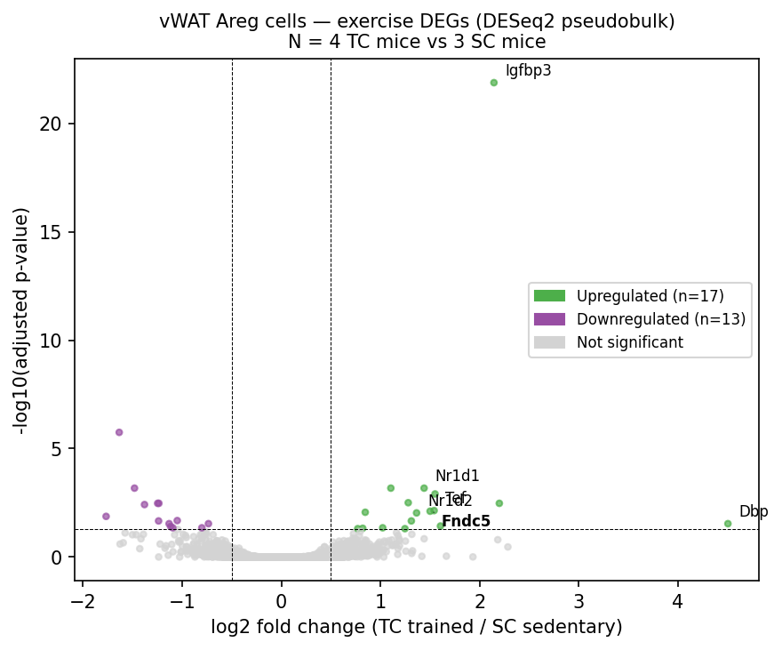
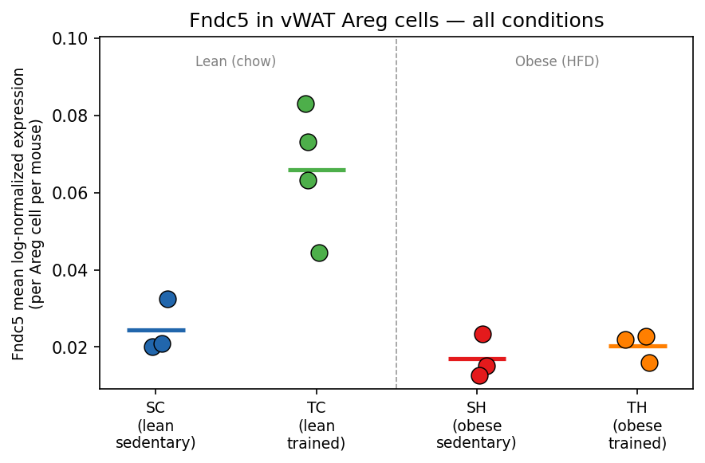
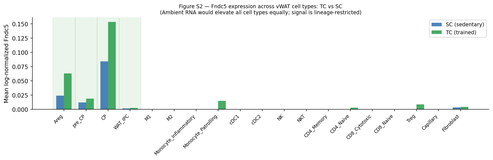

# Exercise Induces Fndc5 in Visceral Fat Stem Cells

---

## Background

Yang et al. (*Cell Metabolism*, 2022) studied the cellular response of adipose tissue to exercise and obesity. They analyzed 51 mice assigned to four experimental groups defined by diet (high-fat or low-fat) and activity (exercise or sedentary).

Using single-cell RNA analysis on their atlas of 205,000 cells spanning both muscle and adipose tissue, they found that exercise reactivated a circadian clock gene program that obesity had suppressed.

---

## An Updated Approach

We re-analyzed their data, swapping their edgeR test in favor of the updated approach of DESeq2. Both used pseudobulk, which treats each individual mouse as an independent sample. However, DeSeq2 is more cautious with genes that look dramatically changed but are based on only a little data, which is true of this dataset.

Using DESeq2, we recovered the original genes already identified by Yang et al., including the clock genes. However, we also found a new gene — Fndc5 — in adipose tissue, a gene not previously reported in Areg cells specifically.

*Fndc5 (bold) sits just above the significance threshold at padj=0.0077, log2FC=+1.51, alongside the four canonical CLOCK targets (Nr1d1, Nr1d2, Tef, Dbp). Fndc5 is the 13th most significant gene out of 8,407 tested. Its fold-change (+1.51) is comparable to three of the four canonical CLOCK targets in the same analysis (Nr1d1: +1.44, Nr1d2: +1.36, Tef: +1.54).*

---

## The Evidence

### Rank Separation

As a robustness check on the DESeq2 result, we examined whether the signal held at the individual-mouse level rather than being driven by a single outlier. Expression was normalized by each cell's total UMI count (sequencing depth) and averaged across all Areg cells per mouse. Every trained mouse exceeded every sedentary mouse with no exceptions (permutation p=0.029, the minimum achievable with n=4 vs n=3). This is consistent with the pseudobulk result rather than independent confirmation of it — with seven mice total, it is best read as showing the effect is not an artifact of one animal.

*Each dot is one mouse. Line = median. All four trained (TC) mice exceed all three sedentary (SC) mice. Obese conditions (SH, TH) remain near zero — the CLOCK/Fndc5 dissociation is visible directly in the data.*

### Not Caused by Ambient RNA Contamination

We also investigated whether the results could be explained by ambient RNA — a known artifact in single-cell data where RNA from ruptured cells contaminates neighboring droplets. We found that Fndc5 elevation was confined to Areg cells but undetectable in immune cells including T cells, B cells, and macrophages. The elevation is restricted to the adipogenic lineage and absent from immune cells sitting in the same tissue. If the signal were from ambient RNA, we would expect it to appear across all cell types at similar levels.

*Elevation is confined to the adipogenic lineage (shaded). Immune populations (T cells, B cells, NK cells, macrophages) are near zero in both conditions.*

---

## Discussion

Fndc5 was the 13th most significant differentially expressed gene in the analysis (padj=0.0077), and potentially the most surprising biologically — it was found specifically in visceral fat Areg cells, where it had not been reported.

Fndc5 is known to be produced inside muscle cells, where it is cleaved and secreted into the bloodstream as irisin, which ultimately reaches fat tissue where it promotes fat burning. The canonical model places fat as the downstream recipient.

Our reanalysis found that Areg cells — an early adipose progenitor population at the top of the differentiation hierarchy in visceral white adipose tissue (vWAT) — upregulate Fndc5 transcription after exercise. The committed preadipocytes (CP cells) directly below Areg in the hierarchy constitutively express Itgb5, the irisin receptor. If Areg cells produce and secrete irisin locally, they would be signaling onto irisin-responsive progenitors at close range, within the same depot — a local signaling pathway independent of irisin from skeletal muscle.

---

## Still Unknown

While we found significant expression-level changes of Fndc5 in trained mice, it is unclear whether this extends to humans. It is also notable that Fndc5 does not recover in obese trained mice, whereas clock genes regulating circadian rhythm recover in obese trained mice in both our analysis and Yang's. This dissociation suggests that Fndc5 induction requires something beyond clock reactivation alone — something present in lean exercise but absent or impaired in the obese state.

---

## Reproducing the Analysis

**Data:** Download `GSE183288_Single_cell_atlas.h5ad` (converted from the original Seurat `.qs` file using `export_seurat.R` + `assemble_h5ad.py`).

**Key notebooks** (in `python_pipeline/`):

- `8_pseudobulk_differential_expression.ipynb` — runs DESeq2 pseudobulk across all vWAT cell states; produces the DEG results including Fndc5 at rank 13
- `9_rescue_and_cell_state_deep_dives.ipynb` — Areg deep dive; generates the volcano plot, per-mouse strip plot, ambient RNA figure, and CLOCK/Fndc5 dissociation analysis

Run NB8 before NB9 — NB9 loads NB8's output CSV.
